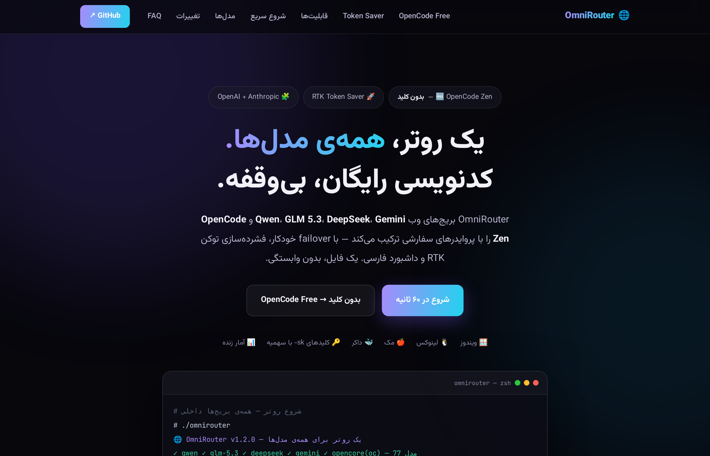
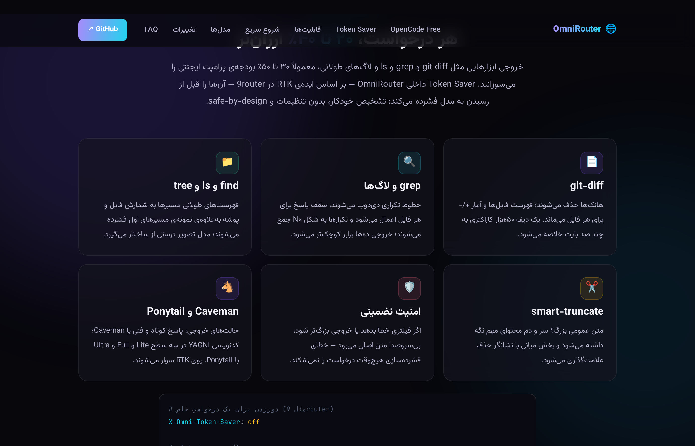

# 🌐 OmniRouter — یک روتر، همه‌ی مدل‌ها

<div align="center">

[](https://github.com/Godde3s/omnirouter/releases)
[](https://go.dev)
[](https://github.com/Godde3s/omnirouter/releases)
[](LICENSE)

### **Qwen · GLM 5.3 · DeepSeek · Gemini · OpenCode (بدون کلید!) · هر API دیگه — با یک کلید، یک لاگین، یک آدرس**

کیفیت واقعی API روی وبِ رایگانِ چت‌بات‌ها + ارائه‌دهنده‌های سفارشی + داشبورد کامل فارسی

`OpenAI API` · `Anthropic API` · `OpenCode Free بدون کلید` · `RTK Token Saver` · `کمبوهای fallback` · `SSE استریم` · `Tool Calling` · `Failover خودکار` · `Alias مدل` · `سهمیه کلید`

**→ 🎨 [مستندات کامل، دموی زنده و راهنمای مصور در GitHub Pages](https://godde3s.github.io/omnirouter/) ←**



</div>

---

## 🚀 چه خبره از v1.0.0 تا v1.2.0؟

| نسخه | چه چیزهایی اضافه/عوض شد |
|---|---|
| **v1.2.0** (امروز) | 🆓 **پروایدر OpenCode Zen (`oc`)** — مدل‌های رایگان **بدون هیچ کلیدی** (مثل OpenCode Free در 9router) + fetch خودکار ۷۰+ مدل + کلید اختیاری برای مدل‌های پولی zen · 🚀 **RTK Token Saver** — فشرده‌سازی خودکار خروجی ابزارها (git diff/grep/ls/لاگ) با فیلترهای امن · 🎯 **کمبوهای نام‌دار** — `combo:free-stack` زنجیره‌ی qwen→gemini→oc آماده‌ی نصب تازه · 🐴 **Caveman + Ponytail** (Lite/Full/Ultra) با هدر `X-Omni-Prompt-Mode` · 🏷 **GLM 5.3 و GLM 5.3-Flash** — نام‌گذاری جدید پرچم‌دار Z.AI · 🖥 **داشبورد ۲.۰** با سایدبار حرفه‌ای، Token Saver، کمبوها و پلی‌گراند جدید · 🐞 فیکس health-check بریج‌ها (توکن روی fetch مدل‌ها) |
| **v1.1.1** (امروز) | 🐞 **فیکس استاندارد OpenAI**: وقتی کلاینت فیلد `stream` را نمی‌فرستد (OpenCode و خیلی‌ها همین‌اند)، حالا **JSON** برمی‌گردد نه SSE — سینک‌شده به هر ۵ ریپو (qwen v1.0.3، glm v1.0.3، gemini v1.0.2) + ۳ چک رگرسیون جدید (smoke 34/34) |
| **v1.1.0** | 🧬 برج **Gemini** (مهمان بدون کوکی، ویژن، heartbeat خودکار PSIDTS) · 📊 **آمار مصرف واقعی** (توکن هر درخواست، نمودار ۴۸ ساعته) · 🎭 **Alias مدل** (`gpt-4o` → `qwen3.8-max`) · 🔑 **سهمیه + Allowlist** per-key · ⏱ Retry/Cooldown هوشمند · 🔢 `/v1/messages/count_tokens` · 🎛 داشبورد v2 با KPI و پلی‌گراند |
| **v1.0.0** | 🌱 تولد: روتر یکپارچه روی ۳ بریج، دو پروتکل کامل، failover، داشبورد فارسی، Release CI پنج‌پلتفرمه |



---

## این چیه؟

OmniRouter چهار بریج اثبات‌شده‌ی **qwen-free-api**، **glm-free-api**، **deepseek-free-api** و **gemini-free-api** را به‌عنوان کتابخانه داخل خودش دارد و روی آن‌ها یک لایه‌ی روتر کامل می‌سازد — دقیقاً همان کاری که ۹router برای APIهای رسمی می‌کند، اما برای **وبِ رایگان** مدل‌ها:

| قابلیت | وضعیت |
|---|---|
| یک کلید برای همه‌ی مدل‌ها (`sk-…`) | ✅ |
| `/v1/chat/completions` سازگار با OpenAI + استریم SSE | ✅ |
| `/v1/messages` سازگار با Anthropic + `/v1/messages/count_tokens` | ✅ |
| Tool calling کامل (چرخه‌ی R1→R2) برای Hermes/OpenCode/Cline | ✅ |
| مدل `auto` با زنجیره‌ی failover بین ارائه‌دهنده‌ها | ✅ |
| **برج Gemini وب** — مهمان بدون کوکی هم کار می‌کند (اثبات زنده) | ✅ |
| **OpenCode Zen (پروایدر `oc`)** — مدل‌های رایگان **بدون کلید**، fetch خودکار، Anthropic ترجمه‌شده | ✅ v1.2.0 |
| **RTK Token Saver** — فشرده‌سازی خودکار tool_result (git diff / grep / ls / لاگ) + آمار بایت صرفه‌جویی‌شده | ✅ v1.2.0 |
| **کمبوهای نام‌دار** — `combo:my-stack` با fallback ترتیبی + کمبوی آماده `free-stack` | ✅ v1.2.0 |
| **Caveman / Ponytail** — حالت‌های خروجی کم‌مصرف + هدر bypass `X-Omni-Token-Saver: off` | ✅ v1.2.0 |
| اضافه‌کردن API دلخواه (Gemini AI Studio، OpenRouter، Groq، Ollama، …) از داشبورد | ✅ |
| **نگاشت مدل (alias)** — مثلاً `gpt-4o` → `qwen3.8-max` برای هر پروایدر | ✅ v1.1.0 |
| **آمار مصرف زنده**: توکن واقعی هر درخواست، نمودار ۴۸ ساعته، تفکیک پروایدر/مدل | ✅ v1.1.0 |
| **سهمیه و محدودیت کلید**: سقف درخواست + لیست مدل مجاز per-key | ✅ v1.1.0 |
| **Retry + Cooldown هوشمند**: تلاش مجدد هر پروایدر، سردشدن خطاکارها قبل از failover | ✅ v1.1.0 |
| **پلی‌گراند**: چت مستقیم با هر مدل از داشبورد (استریم + thinking) | ✅ v1.1.0 |
| داشبورد فارسی RTL با KPI، نمودار، لاگ‌های زنده | ✅ |
| تک‌فایل، بدون وابستگی — لینوکس / ویندوز / مک / داکر | ✅ |

## شروع سریع (۳۰ ثانیه)

```bash
# ۱) دانلود باینری از Releases (یا بیلد با Go)
./start.sh

# ۲) اولین اجرا خودش .env می‌سازد — حداقل یک اعتبار بگذار:
#    DEEPSEEK_TOKENS=...   ← از ./ds-login
#    QWEN_TOKENS=...       ← اختیاری (مهمان هم کار می‌کند)
#    GEMINI_COOKIES=...    ← اختیاری (مهمان هم کار می‌کند!)

# ۳) داشبورد:  http://localhost:8080   (رمز پیش‌فرض: admin)
```

### اتصال کلاینت‌ها

**OpenAI سازگار (OpenCode / Hermes / Cline / هر کلاینت):**
```bash
Base URL:  http://localhost:8080/v1
API Key:   sk-…        (از داشبورد)
Model:     auto        ← بهترین ارائه‌دهنده‌ی سالم، با failover
```

**Anthropic سازگار (Claude Code و…):**
```bash
ANTHROPIC_BASE_URL=http://localhost:8080
ANTHROPIC_API_KEY=sk-…
```

```python
from openai import OpenAI
client = OpenAI(base_url="http://localhost:8080/v1", api_key="sk-…")
client.chat.completions.create(model="auto", messages=[{"role":"user","content":"سلام"}])
```

## مدل‌ها

| ارائه‌دهنده | مدل‌ها | ورود |
|---|---|---|
| **Qwen** (chat.qwen.ai) | `qwen3.8-max` (پرچم‌دار) · `qwen3.7-plus` | مهمان یا توکن |
| **Gemini** (gemini.google.com) | `gemini-3.6-flash` · `gemini-3.5-flash-lite` · `gemini-3.1-pro` + کشف زنده | **مهمان بدون کوکی** یا کوکی |
| **DeepSeek** (chat.deepseek.com) | `deepseek-chat` · `deepseek-reasoner` | توکن الزامی |
| **GLM** (chat.z.ai) | `glm-5.3` · `glm-5.3-flash` · `glm-5.2` + کشف خودکار | توکن دیوایس |
| **سفارشی** | هر چیزی که خودت اضافه کنی (مثلاً `gemini-2.5-pro` با کلید رایگان AI Studio) | کلید خودت |

آدرس‌دهی: `auto` (زنجیره) · `qwen/qwen3.8-max` (صریح) · خودِ نام مدل (کاتالوگ مشترک) · **نام عمومی نگاشت‌شده** (مثل `gpt-4o` اگر alias بسازی)

## قابلیت‌های جدید v1.1.0+

### 📊 آمار مصرف (بدون وابستگی خارجی)
- هر درخواست (استریم یا غیراستریم) از پاسخ آپستریم **توکن واقعی** استخراج می‌شود (`usage` فرمت OpenAI و Anthropic)؛ اگر آپستریم توکن نداد، تخمین می‌زند
- نمودار ۴۸ ساعته‌ی درخواست/توکن در داشبورد (Canvas خالص)
- تفکیک per-provider / per-model / per-key + ساعتی — API: `GET /admin/api/stats`

### 🔀 نگاشت مدل (alias)
- برای هر پروایدر (بریج یا سفارشی): نام عمومی → مدل واقعی
- مثال: `gpt-4o` → `qwen3.8-max` — کلاینت‌هایی که فقط gpt-4o می‌شناسند بدون تغییر کد به قوی‌ترین مدل می‌رسند
- کاتالوگ `/v1/models` نام عمومی را با `alias_for` نشان می‌دهد
- مدیریت از داشبورد یا `POST /admin/api/aliases {"provider":"qwen","map":{"gpt-4o":"qwen3.8-max"}}`

### 🔑 سهمیه و محدودیت کلید
- `max_requests`: سقف کل درخواست‌های یک کلید (عبور → 429 دوزبانه)
- `allowed_models`: لیست مجاز — مدل دقیق، `qwen/*` (وایلدکارت پروایدر) یا `*`
- ساخت از داشبورد یا `POST /admin/api/keys {"name":"x","max_requests":1000,"allowed_models":["qwen/*"]}`

### ⏱ Retry + Cooldown
- `RETRY_PER_PROVIDER` (پیش‌فرض ۱): تعداد تلاش هر پروایدر قبل از رفتن به بعدی
- `COOLDOWN_SECONDS` (پیش‌فرض ۲۰): پروایدر خطاکار موقتاً کنار می‌رود؛ اگر *همه* روی cooldown بودند، به‌هرحال تلاش می‌شود (cooldown ترجیح است نه بلوک)
- `REQUEST_TIMEOUT` (پیش‌فرض ۳۰۰): تایم‌اوت سخت فقط برای غیراستریم — استریم‌های reasoning محدود نمی‌شوند

### 🎛 پلی‌گراند داشبورد
- چت با هر مدل کاتالوگ (حتی `auto`)، استریم زنده، نمایش `reasoning_content` جدا، temperature
- همان کلید اولِ لیست را استفاده می‌کند

## داشبورد

- **نمای کلی**: KPI (درخواست‌ها، توکن‌ها، خطاها، آپ‌تایم) + نمودار ۴۸ ساعته + کارت سلامت هر پروایدر
- **ارائه‌دهنده‌ها**: وضعیت بریج‌ها + افزودن/ویرایش API سفارشی با پیش‌تنظیم (✨ Gemini AI Studio / OpenRouter / Groq / Ollama / LM Studio) + نگاشت مدل هر پروایدر
- **مدل‌ها**: کاتالوگ زنده با فیلتر و نمایش alias
- **کلیدها**: ساخت با سهمیه/محدودیت، مصرف زنده (درخواست/توکن)، خاموش/روشن/حذف
- **لاگ‌ها**: ۵۰۰ درخواست آخر با توکن، تأخیر، خطا + به‌روزرسانی زنده
- **پلی‌گراند**: چت زنده با هر مدل

## حالت‌های مهمان و توکن‌ها

| سرویس | بدون توکن | با توکن |
|---|---|---|
| Qwen | مهمان (روی IP خانگی؛ روی سرور یک‌بار `./qwen-bx`) | پول چنداکانتی + استریم پایدارتر |
| Gemini | **مهمان بدون هیچ کوکی** (اثبات زنده روی IP دیتاسنتر) | سهمیه کامل + پول چنداکانتی (`GEMINI_COOKIES`) |
| GLM | مهمان (نیاز به دیوایس‌توکن کپچا در `tokens.sqlite` یا `ZAI_TOKENS`) | پول چنداکانتی |
| DeepSeek | ❌ ندارد | توکن الزامی (`./ds-login`) |

ابزارهای کمکی (اختیاری، هرکدام یک‌بار اجرا می‌شوند):
```bash
./ds-login     # گرفتن توکن دیپ‌سیک با مرورگر
./qwen-bx      # هدرهای Baxia برای حالت مهمان قوِن روی IP دیتاسنتر
```

## متغیرهای محیطی (خلاصه)

```env
PORT=8080                 # پورت عمومی روتر
ADMIN_PASSWORD=admin      # رمز داشبورد — عوضش کن!
ROUTER_KEY=               # کلید اول (خالی = تولید خودکار)
AUTO_CHAIN=qwen/qwen3.8-max,ds/deepseek-chat,gemini/gemini-3.6-flash,glm/glm-5.3,oc/big-pickle
AGENT_MODE=1              # شیم tool-calling برای ایجنت‌ها

RETRY_PER_PROVIDER=1      # تلاش مجدد هر پروایدر
COOLDOWN_SECONDS=20       # سردشدن پروایدر خطاکار
REQUEST_TIMEOUT=300       # تایم‌اوت غیراستریم (ثانیه)

QWEN_TOKENS=  QWEN_BX_FILE=qwen-bx.json
ZAI_TOKENS=   GLM_TOKEN_DB=tokens.sqlite
DEEPSEEK_TOKENS=
GEMINI_COOKIES=           # اختیاری — مهمان هم کار می‌کند
AUTH_TOKEN=omni-internal-change-me   # راز داخلی بین هسته و بریج‌ها
```

## داکر

```bash
cp .env.example .env   # اعتبارها را بگذار
docker compose up -d   # http://localhost:8080
```

## معماری

```
کلاینت (OpenCode/Hermes/Cline/…)
        │  یک کلید sk-…
        ▼
┌─────────────────────────── OmniRouter :8080 ───────────────────────────┐
│  /v1/chat/completions   /v1/messages(+count_tokens)   /v1/models       │
│  auth کلید → سهمیه/allowlist → کاتالوگ → resolve (alias) → failover    │
│  استخراج usage → آمار (provider/model/key/hourly) → لاگ حلقه‌ای        │
└────┬─────────────────────┬──────────────────────┬────────────────────┬─┘
     ▼                     ▼                      ▼                    ▼
 qbridge (Qwen)      zbridge (GLM)        dsbridge (DeepSeek)   gbridge (Gemini)
 guest/bx + pool     guest/captcha+pool   PoW(wazero)+pool      مهمان/کوکی+pool
     ▼                     ▼                      ▼                    ▼
 chat.qwen.ai           chat.z.ai          chat.deepseek.com   gemini.google.com
       + ارائه‌دهنده‌های سفارشی (هر endpoint سازگار با OpenAI)
```

- **bridges**: همان کلاینت‌های اثبات‌شده‌ی چهار پروژه‌ی قبلی، دست‌نخورده
- **dsbridge**: پورت کامل Go از کلاینت دیپ‌سیک — حل PoW با اجرای **همان wasm رسمی دیپ‌سیک** داخل wazero (بدون CGO)
- **gbridge**: بریج وب Gemini با استریم افزایشی واقعی، کشف زنده‌ی مدل، ویژن، چرخش خودکار PSIDTS
- **core**: کاتالوگ زنده، failover قبل از اولین بایت استریم، alias، آمار مصرف، کلیدها با سهمیه، لاگ

## عیب‌یابی

| خطا | معنی و راه‌حل |
|---|---|
| `model not found on any provider` | مدل را در داشبورد → مدل‌ها ببین؛ یا `provider/model` بنویس |
| `کلید … مجاز به مدل … نیست` | کلیدت `allowed_models` دارد — از داشبورد → کلیدها بازش کن |
| `سهمیه‌ی کلید … تمام شد` | سقف `max_requests` پر شده — کلید تازه بساز یا سقف را بالا ببر |
| `هیچ اکانت DeepSeek ثبت نشده` | `./ds-login` را اجرا کن و `DEEPSEEK_TOKENS` را پر کن |
| `captcha verification rejected` (GLM) | دیوایس‌توکن‌های `tokens.sqlite` منقضی شده‌اند — `ZAI_TOKENS` بگذار یا توکن‌ها را تازه کن |
| `unauthorized — refresh the token` (Qwen) | توکن‌های `QWEN_TOKENS` منقضی‌اند؛ یا یک‌بار `./qwen-bx` برای مهمان |
| Gemini خطای سهمیه داد | حالت مهمان محدود است — `GEMINI_COOKIES` اضافه کن (کوکی `__Secure-1PSID` از مرورگر) |
| داشبورد باز نمی‌شود | رمز `ADMIN_PASSWORD` را در `.env` چک کن |

## English Summary

OmniRouter embeds the proven **qwen-free-api**, **glm-free-api**, **deepseek-free-api** and **gemini-free-api** bridges as libraries behind one OpenAI/Anthropic-compatible gateway: one `sk-…` key, live model catalog, cross-provider failover (`auto`), model aliasing, per-key quotas + allowlists, real token-usage analytics (streaming-aware), retry/cooldown, custom OpenAI-compatible providers, a playground and a Persian-RTL dashboard. Anthropic parity includes `/v1/messages/count_tokens`. **v1.1.1 fixes OpenAI-spec `stream` defaulting** (omitted `stream` now returns JSON, not SSE). DeepSeek's proof-of-work is solved natively by executing DeepSeek's own WASM via wazero — pure Go, zero CGO. Gemini web bridge works **guest, cookie-less** (verified live from datacenter IPs). Single static binary for Linux / Windows / macOS / Docker. **Docs site & demo: <https://godde3s.github.io/omnirouter/>** · See `.env.example` and the troubleshooting table above.

## License

MIT — مصرف شخصی و آموزشی. با احترام به شرایط سرویس‌های آپستریم، مسئولیت استفاده با خود شماست.

---

<div align="center">

**🌐 [دمو و مستندات مصور — GitHub Pages](https://godde3s.github.io/omnirouter/)** · بریج‌های مستقل: [Qwen](https://github.com/Godde3s/qwen-free-api) · [GLM](https://github.com/Godde3s/glm-free-api) · [DeepSeek](https://github.com/Godde3s/deepseek-free-api) · [Gemini](https://github.com/Godde3s/gemini-free-api)

اگر این پروژه به کارت اومد، یک ⭐ به ریپو بده!

</div>
